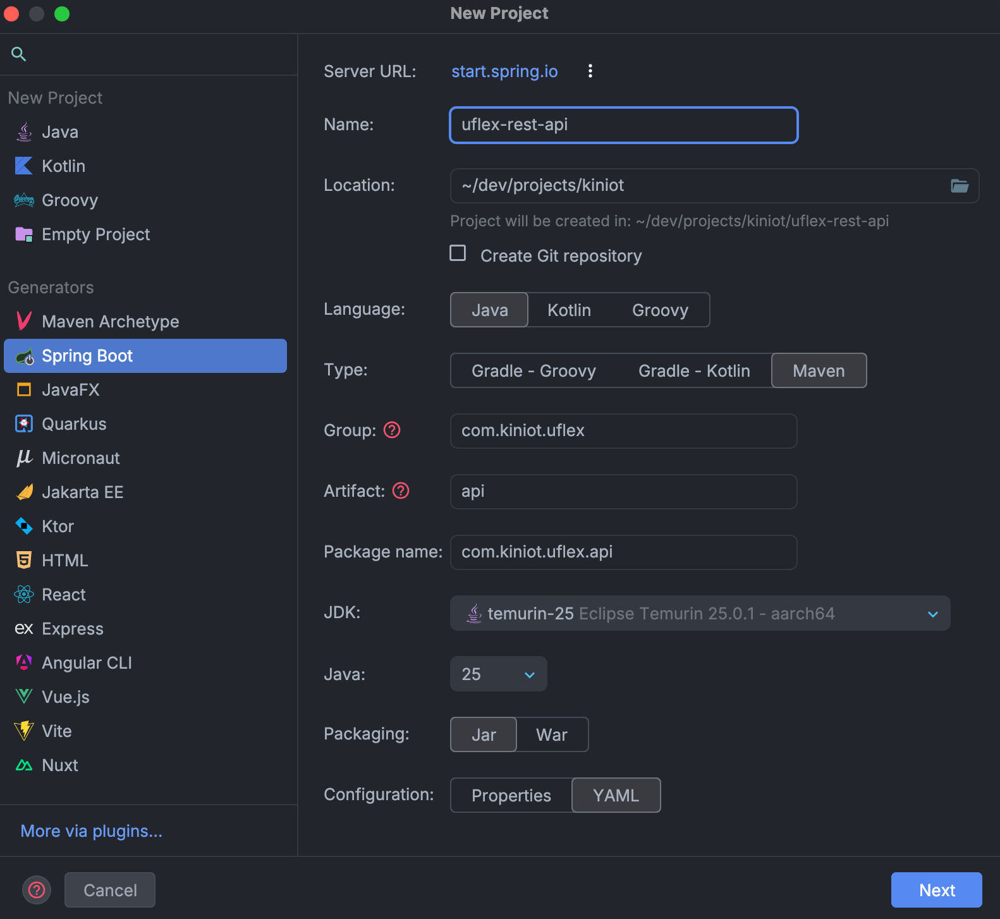
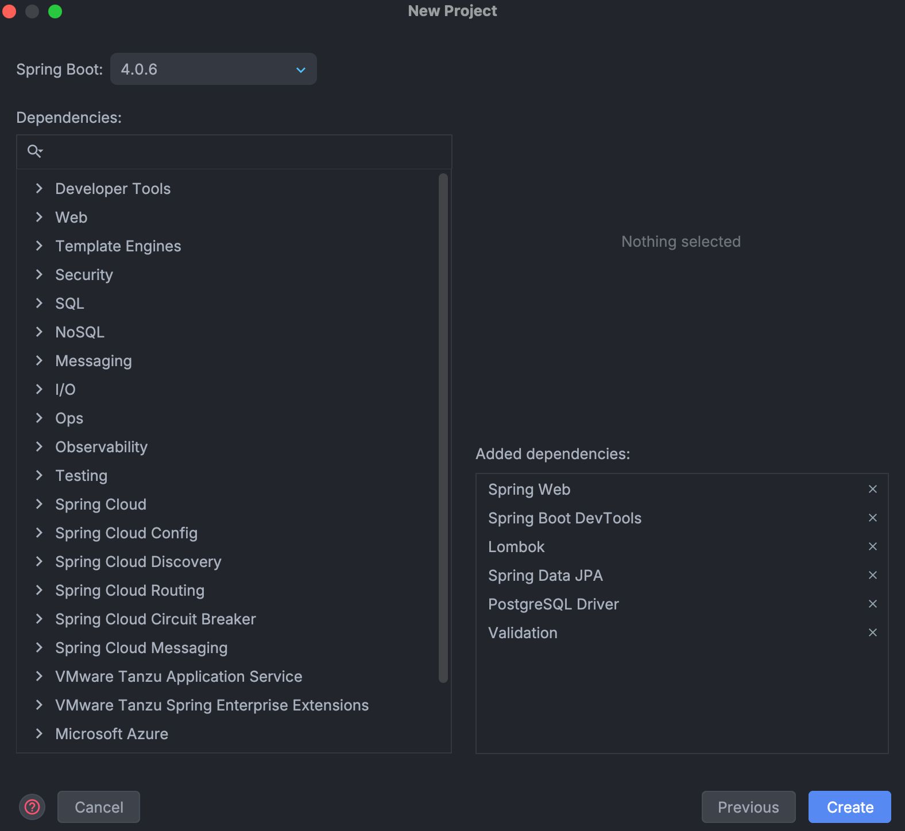

# uFlex REST API - Setup and Configuration Guide

## Initial Project Setup with Spring Initializr

This project has been created using the IntelliJ IDEA Ultimate interface, leveraging its integration with Spring Initializr to quickly configure a Spring Boot project with the necessary dependencies.

- **Name:** `uflex-rest-api` was chosen to clearly reflect its function within the uFlex ecosystem as the central entry point for network operations.
- **Language:** Java, as it is the primary language for developing Web Services based on the Spring Boot framework.
- **Type:** Maven, due to its wide adoption and compatibility with Spring Boot, in addition to facilitating dependency management and project building.
- **Group:** `com.kiniot.uflex`, following the Java package naming convention (inverted domain), reflecting the startup (KinIoT) and the project (uFlex).
- **Artifact:** `api`, a name that clearly reflects the nature of the component as the main programmatic interface (Backend API) that exposes business logic to the various clients of the solution.
- **Package name:** `com.kiniot.uflex.api`, following the Java package naming convention, reflecting the project structure and its function of centralizing web services that connect the system core with web and mobile applications.
- **JDK:** temurin-25, the latest stable JDK version, which offers performance improvements and new features, ensuring that the project is up-to-date and compatible with the latest technologies.
- **Java:** 25, to take advantage of the latest language features and ensure compatibility with the selected JDK.
- **Packaging:** Jar, as it is the standard format for Spring Boot applications, facilitating its execution and deployment.
- **Configuration:** YAML, for its readability and ease of use for Spring Boot configuration, allowing a clear and organized structure for project properties.

## Project Dependencies and Required Libraries

The latest version of Spring Boot (4.0.6) was used and the following dependencies were selected to meet the service needs:

- **Spring Web:** To build RESTful APIs and handle HTTP requests.
- **Spring Boot DevTools:** To improve the development experience with automatic reload and other useful features during local development.
- **Spring Data JPA:** To facilitate interaction with the PostgreSQL database using the repository pattern.
- **PostgreSQL Driver:** To connect with the PostgreSQL database.
- **Lombok:** To reduce boilerplate code, such as getters, setters, constructors, etc.
- **Validation:** To validate user inputs in REST endpoints.

Subsequently, other key dependencies were added for the specific functionality of the service, some are:

- **Springdoc OpenAPI Scalar:** To automatically generate REST API documentation and Scalar integration with OpenAPI.
- **Spring Boot Actuator:** To expose monitoring and health endpoints of the service.
- **Spring Security:** To implement authentication and authorization, especially with JWT.
- **jjwt:** To handle JWT token creation and validation (`jjwt-api`, `jjwt-impl`, `jjwt-jackson`).
- **Java UUID Generator:** For UUID v7 generation.
- **Pluralize:** To support text pluralization utilities within the project (used for database tables).
